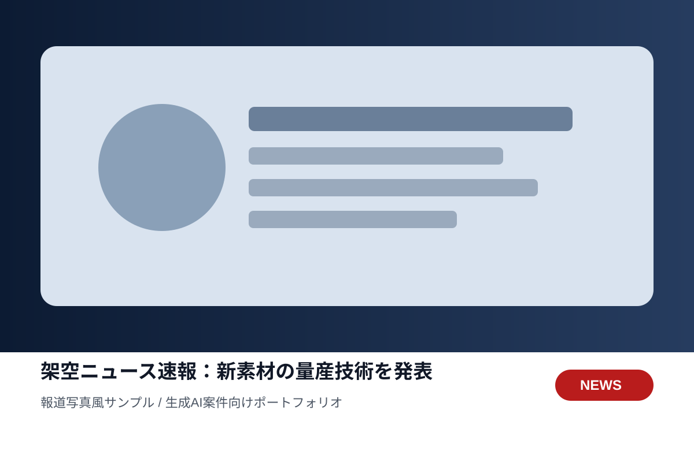
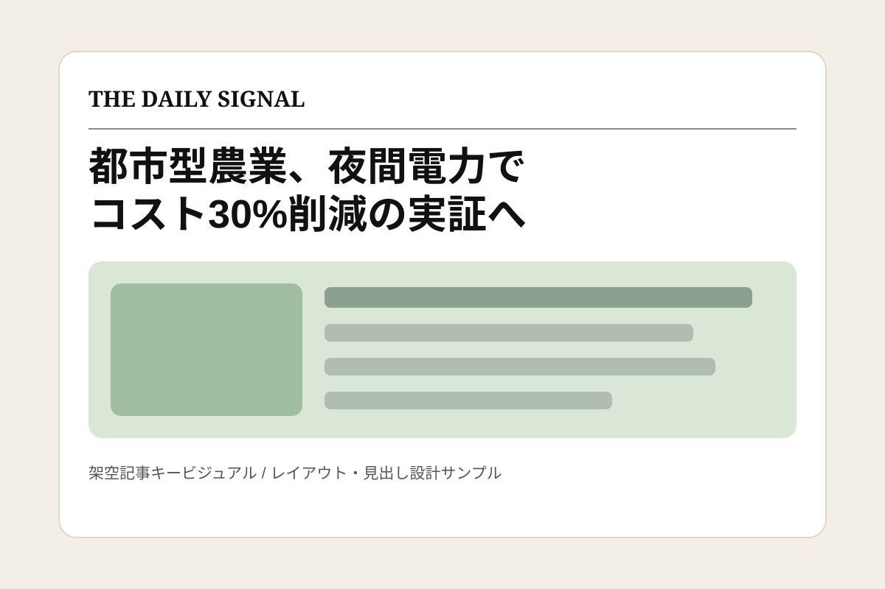
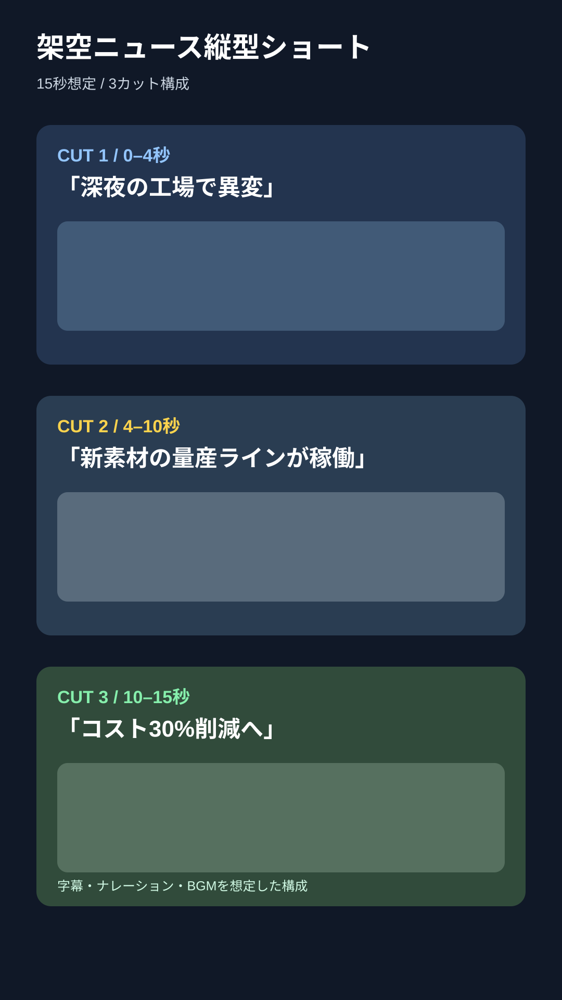

# 生成AI 画像・動画サンプル

クラウドワークス等の生成AI案件向けに作成した公開サンプルです。

## 1. 架空ニュース報道写真風サンプル

- 用途：架空ニュース、報道番組風素材、記事サムネイル
- 想定作業：画像生成 → 構図調整 → テロップ/見出し配置 → 納品用整形
- ポイント：ニュースらしいトーン、余白、情報の優先順位を意識

## 2. 架空ニュース記事キービジュアル

- 用途：Web記事、ニュース記事、SNS告知
- 想定作業：テーマ設計 → キービジュアル生成 → 見出し設計 → レイアウト調整
- ポイント：媒体に合わせて、写真だけでなく記事全体の見え方まで整える

## 3. 縦型ショート動画 絵コンテサンプル

- 15秒想定
- 3カット構成
- テロップ、ナレーション、BGM込みで編集可能
- 用途：YouTube Shorts / TikTok / Reels / 架空ニュース動画

## 対応可能な作業

- 生成AIによる画像制作
- 商品画像 / 広告素材 / ニュース風素材
- 画像から縦型ショート動画化
- テロップ・BGM・ナレーションを含む簡易編集
- リファレンスに合わせた構図・雰囲気調整
- 複数案の比較・修正

※このページの内容は架空のサンプルです。実在のニュース・企業・人物を扱ったものではありません。
